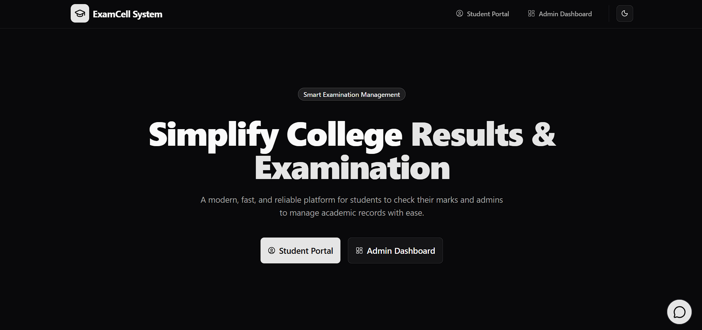

  

<h1 align="center">🎓 ExamCell System</h1>

  <b>Smart Examination Management Platform</b> 
  Digitizing and simplifying academic result processing for modern institutions.

  <a href="https://exam-cell-management-system-tsdc.vercel.app/"><b>🌐 Live Website</b></a>

  
  
  
  

---

  

---

## 📌 Project Overview

**ExamCell System** is a web-based examination management application built to modernize how educational institutions handle student exam records and results.

The system provides a centralized digital platform where administrators can manage student data, process marks, and publish results efficiently. Students can instantly check their performance using their roll numbers without paperwork or delays.

This platform reduces manual workload, minimizes calculation errors, and ensures fast and reliable result handling in a secure environment.

---

## 🚀 Key Features

- 🎓 Student result lookup using Roll Number
- 📊 Automated total marks calculation
- 🧮 Pass / Fail / ATKT status detection
- 🧑‍💼 Admin dashboard for managing student records
- ⚡ Fast and lightweight interface
- 📱 Fully responsive design
- 🔒 Secure data handling

---

## 🖥️ System Modules

### 👨‍🎓 Student Portal

- Enter roll number
- View subject-wise marks
- Check result status

### 👩‍💼 Admin Dashboard

- Manage students
- Upload and edit marks
- View academic records
- Maintain exam data

---

## 📸 Website Screenshots

  

---

## 🎥 Demo Video

  <video width="700" controls>
    <source src="./public/video/Student Dashboard Video.mp4" type="video/mp4">
    Your browser does not support the video tag.
  </video>

---

## 🛠️ Tech Stack

| Layer                 | Technology                   |
| --------------------- | ---------------------------- |
| Frontend              | HTML, CSS, JavaScript        |
| UI Design             | Modern Responsive Layout     |
| Deployment            | Vercel                       |
| Backend _(optional)_  | Node.js / PHP / Python       |
| Database _(optional)_ | MySQL / MongoDB / PostgreSQL |

---

## 🎯 Use Cases

This system is ideal for:

- Colleges
- Universities
- Training Institutes
- Examination Departments

---

## 🔮 Future Enhancements

- Student login accounts
- PDF result download
- Email/SMS notifications
- Performance analytics
- Multi-institution support

---

## 🤝 Contribution

Contributions are welcome.  
Fork the repository, make improvements, and submit a pull request.

---

## 📜 License

This project is intended for educational and institutional use.

---

<b>Built to power digital examination systems 🚀</b>

